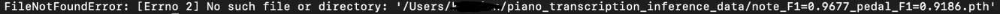

# keiis
A helpful friend for piano practice.

## Feature list: https://www.notion.so/bc6bfb8ff4f34ae4b0e050b117570f42?v=503bffb3330d4ce59d3b53945e48a833

### To run bytedance:
In terminal run:\
`cd <directory of the keiis file>`\
Then run:\
`python3 main.py`

### Known possible errors:
Error 1:\
\
Run `brew install wget` \
 \
Error 2:\
 \
Run `brew install ffmpeg`

